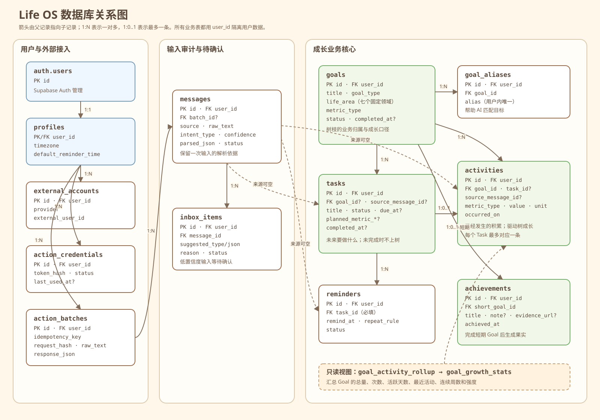

# Life OS MVP

Life OS 把用户的 Todo、长期积累和短期成果转换成一棵可解释的 3D 成长树。

## 这个仓库怎么读

先分清三层：

1. 前端展示层：`app/` 和 `src/components/`
2. 业务与数据层：`src/domain/`、`src/application/`、`src/actions/`、`src/db/`
3. 数据底座：`supabase/`

如果你的目标是“看树长什么样”，优先读树渲染链路；如果你的目标是“看数据怎么进来”，优先读 API 和 domain 层。

## 当前业务模型

七个固定生活领域对应七根一级主树杈：工作、成长、健康、生活、财务、人际关系、娱乐。

- 一次性 Todo（买水、打扫）：不归入 Goal、不显示为树枝；完成后可增加近期水滴、小生物或花草。
- 长期 Goal（健身、弹琴、积累知识）：在所属领域主枝上生成长期目标枝，Activity 形成成长和叶片。
- 短期 Goal（考试、找工作）：在所属领域主枝上生成短期目标枝，完成后成为 Achievement，在果实面板查看。
- 未完成 Task 与 Reminder：保存在数据库并通过独立 API 查询，但不会改变树。

树的成熟度使用前快后慢的指数曲线。前期少量投入能明显成长，成熟后逐渐收敛，永久骨架不会因近期低活跃退化。

## 技术结构

```text
Session 前端 / AI Action
  → 统一应用服务
  → Zod 输入契约与目标解析
  → PostgreSQL 事务 RPC
  → Goal / Task / Activity / Reminder / Achievement
  → Dashboard 聚合
  → GrowthMetrics
  → TreeRecipe
  → Semantic Skeleton
  → Three.js TubeGeometry 场景
```

主要技术：Next.js 15、React 19、TypeScript、Three.js、Zod、Supabase PostgreSQL、Vitest。

## 前后端分工

前端负责：

- 登录后展示自己的 Dashboard
- 渲染 3D 树、果实面板、详情面板
- 通过 `/api/dashboard`、`/api/tasks`、`/api/reminders` 读取数据
- 通过 `/api/life-events` 写入网页端事件

后端负责：

- 身份识别：Supabase Session 或 Action Token
- 输入校验：Zod schema
- 业务规则：Goal、Task、Activity、Reminder 的一致性
- 数据聚合：把数据库记录转成树可以消费的 view model
- 最终约束：`supabase/schema.sql` 里的表约束和 RPC

## 本地运行

```bash
npm install
npm run dev
```

开发环境可打开：

- `http://localhost:3000/dashboard?userId=demo-user`：本地 demo 成长树
- `http://localhost:3000/mock`：本地 mock 输入

生产环境不接受 query/body 提供的 `userId`，身份必须来自验证过的 Supabase Session 或 Action Token。

## 页面路由和 API 路由

这个项目里 `/dashboard`、`/goals/[id]` 这类路径是页面路由，不是 API。

- 页面路由负责给浏览器直接打开的界面：`app/dashboard/page.tsx`、`app/goals/[id]/page.tsx`
- API 路由负责给页面和 Action 读写数据：`app/api/dashboard/route.ts`、`app/api/goals/[id]/route.ts`

因此：

- `/dashboard` 是网页页面，页面本身会去请求 `/api/dashboard`
- `/goals/[id]` 是网页页面，通常配合 `/api/goals/[id]` 获取或更新目标数据
- 真正带 `/api/` 前缀的，才是接口

## API

当前共有 10 个 API 路由。

| 方法与路径 | 用途 | 身份 |
| --- | --- | --- |
| `POST /api/life-events` | 网页批量写入 Life Event | Supabase Session |
| `POST /api/actions/life-events` | AI/自动化批量写入 | Action Token |
| `GET /api/actions/context` | AI 获取已有 Goal、别名和 open Task | Action Token |
| `GET /api/tasks` | 查询 Todo，默认 open | Supabase Session |
| `GET /api/reminders` | 查询 Reminder，默认 scheduled | Supabase Session |
| `POST /api/tasks/[id]/complete` | 完成 Task | Session 或 Action Token |
| `POST /api/goals/[id]/complete` | 完成 Goal/生成短期成果 | Session 或 Action Token |
| `GET /api/dashboard` | Dashboard 数据 | Supabase Session |
| `GET /api/goals/[id]` | Goal 详情 | Supabase Session |
| `POST /api/intake` | 仅开发环境 mock 输入 | 本地 demo |

旧的 `POST /api/actions/life-event` 已删除并返回普通 404。

## 数据库

最终结构以 [supabase/schema.sql](supabase/schema.sql) 为准。项目采用空库重建方式，不执行旧数据迁移；Ability 表与 `ability_id` 已删除。

数据库的设计重点不是“每个领域建一张表”，而是把稳定的业务实体分开保存，再用外键建立关系：

- 每个登录账号由 Supabase Auth 的 `auth.users` 管理，并对应一条 `profiles`。
- 七个生活领域是 `goals.life_area` 的固定取值，不是七张重复结构的领域表。
- `goals` 表示用户想持续推进或最终完成的方向，是树枝的业务来源。
- `tasks` 表示未来要做的事项；open Task 供 Todo 页面和 Reminder 使用，不直接上树。
- `activities` 表示已经发生的成长投入，必须属于某个 Goal，是树成长的主要数据来源。
- `achievements` 只对应已完成的短期 Goal，是树上的果实和果实面板的数据来源。
- `messages` 保存自然语言输入及解析结果，便于审计；普通网页表单未来可直接创建业务记录，所以业务表的 `source_message_id` 允许为空。

### 数据库关系图



如果图中文字过小，可以[单独打开 SVG 原图](docs/database-relationship.svg)。图中的箭头由父记录指向子记录；为了避免线条过密，没有重复绘制每张表到 `profiles.user_id` 的归属线。

### 核心表

| 表 | 保存什么 | 关键字段与约束 | 主要使用位置 |
| --- | --- | --- | --- |
| `profiles` | 用户的 Life OS 配置 | `user_id` 同时是主键和 `auth.users.id` 外键；保存时区和默认提醒时间 | Action 上下文、所有业务数据的用户边界 |
| `external_accounts` | 微信、Telegram、App 等外部账号与用户的映射 | `(provider, external_user_id)` 唯一 | 为未来外部消息入口预留 |
| `action_credentials` | AI Action 的访问凭证 | 只保存唯一的 `token_hash`；支持 active/revoked 和最后使用时间 | Action Token 鉴权 |
| `action_batches` | 一批 Life Event 的幂等写入记录 | `(user_id, idempotency_key)` 唯一；保存请求哈希和最终响应 | 两个 Life Event API 共用 |
| `goals` | 长期目标或短期目标 | `goal_type` 为 long_term/short_term；`life_area` 必须是七领域之一；`metric_type` 为 duration/count/milestone；completed 必须有 `completed_at` | Dashboard、Goal 详情、树枝、成果完成 |
| `goal_aliases` | 一个 Goal 的其他叫法 | `(user_id, alias)` 唯一且必须指向同一用户的 Goal | AI 匹配用户话语中的目标 |
| `messages` | 原始输入、解析意图和置信度 | 可关联一个 `action_batches`；一次批量请求最多 20 个 event | 写入审计、低置信度分流 |
| `tasks` | 未完成、已完成或已取消的 Todo | `goal_id` 可空；计划指标三字段必须同时为空或同时有效；completed 与 `completed_at` 严格一致 | Task 列表、提醒、完成 Task |
| `activities` | 已经发生的成长记录 | Goal 必填；值必须大于 0；指标类型必须与 Goal 一致；每个 Task 最多产生一条 Activity | 树成长、Goal 详情和 Dashboard 聚合 |
| `reminders` | Task 的提醒计划 | `task_id` 必填；支持 none/daily/weekly 和 scheduled/sent/cancelled | Reminder API、Task 列表 |
| `inbox_items` | 无法可靠分类、等待确认的输入 | 必须关联 `messages`；状态为 pending/resolved/dismissed | Dashboard 待确认计数 |
| `achievements` | 已完成的短期成果 | 一个短期 Goal 最多一条；数据库触发器禁止关联长期或未完成 Goal | 果实和果实面板 |

数据库还提供两个只读视图：`goal_activity_rollup` 按 Goal 汇总 Activity，`goal_growth_stats` 在此基础上计算活跃天数、连续周数和相对强度。当前 Dashboard 服务直接读取基础表后在 domain 层聚合，这两个视图为以后把更多聚合下推到数据库预留。

### Task 与 Activity 的关系

二者不能合并，因为它们分别表达“计划”和“事实”：

```text
创建 Task：今晚跑步 30 分钟
  → tasks.status = open
  → Todo 页面可见，树不变化

完成 Task
  → tasks.status = completed，写入 completed_at
  → 如果 Task 属于 Goal，同时创建一条 Activity
  → Activity 记录实际完成量，Dashboard 重新计算树的成长
  → 该 Task 的 scheduled Reminder 自动取消
```

没有 Goal 的一次性 Task 完成后不会创建 Activity，但 Dashboard 会读取近期已完成的一次性 Task，用于水滴、小生物等生命力装饰。未完成 Task 永远不会生成树枝或叶片。

### 指标与单位

一个 Goal 只能采用一种成长口径，数据库通过组合外键保证 Task/Activity 的指标类型与 Goal 一致：

| `metric_type` | 数据库存储单位 | 示例 |
| --- | --- | --- |
| `duration` | `minute` | 1 小时 30 分钟写成 `value = 90, unit = minute` |
| `count` | `count` | 阅读 3 篇文章写成 `value = 3` |
| `milestone` | `count` | 完成一个阶段写成 `value = 1` |

API 可以在完成 Task 时接收 hour，但事务 RPC 会在写入 Activity 前统一换算成 minute，避免 SQL 聚合时把“1 小时 + 30 分钟”错误计算为 31。

### 写入链路

网页入口与 AI 入口的区别只有身份来源，二者不会复制业务代码：

```text
POST /api/life-events              Supabase Session
POST /api/actions/life-events      Action Token
             │
             └→ recordLifeEventBatch 应用服务
                  → Zod 校验和 Goal 匹配
                  → record_life_event_batch PostgreSQL RPC
                  → 单事务写入 batch / message / goal / task /
                    reminder / activity / inbox item
```

`complete_growth_task` RPC 会原子地完成 Task、取消 Reminder，并在有 Goal 时创建 Activity。`complete_growth_goal` RPC 会完成 Goal，并只为短期 Goal 创建或更新 Achievement。三个 RPC 都支持重复请求保护，避免同一次操作生成重复成长数据。

### API 与数据库映射

| API | 主要读取 | 主要写入 |
| --- | --- | --- |
| `POST /api/life-events` | Goal、Alias、Task 上下文 | 通过批量 RPC 写入相关业务表 |
| `POST /api/actions/life-events` | 同上 | 与网页入口共用同一批量 RPC |
| `GET /api/actions/context` | `profiles`、`goals`、`goal_aliases`、open `tasks` | 更新 Action 凭证最后使用时间 |
| `GET /api/tasks` | `tasks`，并联查 `goals`、`reminders` | 无 |
| `GET /api/reminders` | `reminders`，并联查 `tasks` | 无 |
| `POST /api/tasks/[id]/complete` | 目标 Task 和 Goal 指标 | `tasks`、`reminders`、`activities` |
| `POST /api/goals/[id]/complete` | 目标 Goal | `goals`、短期 Goal 的 `achievements` |
| `GET /api/dashboard` | `goals`、`activities`、近期一次性 `tasks`、`achievements`、`inbox_items` | 无 |
| `GET /api/goals/[id]` | 与 Dashboard 相同的成长数据，再筛选指定 Goal | 无 |
| `POST /api/intake` | 本地内存 demo store | 本地内存；不写 Supabase |

### 权限边界

所有 public 业务表都启用了 Row Level Security，登录用户只能 select 自己 `user_id` 的记录。`anon` 和 `authenticated` 角色不能直接增删改业务表；正式写入由服务端校验身份后，通过 service role 和受控 RPC 完成。这能让 Session 前端和未来的 AI 助手共用数据库规则，同时避免浏览器绕过业务约束直接改表。

远程数据库重建会删除现有业务数据，必须在展示项目标识和表清单后另行明确批准。普通测试不会操作远程数据库。

## 验证

```bash
npm test
npm run typecheck
npm run build
npm run test:db
```

`test:db` 使用本地临时 PostgreSQL 验证最终 schema、约束和事务 RPC。

## 树渲染文件结构

树的渲染链路是下面这条：

```text
app/dashboard/page.tsx
→ src/components/GrowthTreeDashboard.tsx
→ src/components/GrowthTreeScene.tsx
→ src/components/RealisticGrowthTree.tsx
→ src/components/growth-tree/GrowthEnvironment.ts
→ src/components/growth-tree/VitalityElements.ts
→ src/components/growth-tree-semantic-geometry.ts
→ src/components/growth-tree-geometry.ts
→ src/domain/tree-visualization.ts
→ src/domain/tree-recipe.ts
→ src/domain/semantic-tree-skeleton.ts
```

职责大致是：

- `app/dashboard/page.tsx`：拿 session，拉 dashboard 数据
- `GrowthTreeDashboard.tsx`：页面壳、果实面板、详情面板、选择态
- `GrowthTreeScene.tsx`：Three.js 场景、相机、光照、点击交互
- `RealisticGrowthTree.tsx`：树干、树枝、叶子、装饰元素的组装
- `growth-tree/*`：环境、生命力粒子、场景参数
- `tree-visualization.ts`：把业务数据转换成树可画的结构
- `tree-recipe.ts`：决定树的骨架、层级、粗细、长度、成熟度
- `semantic-tree-skeleton.ts`：把 recipe 变成可渲染的几何骨架

## 推荐阅读顺序

```text
src/domain/aggregation.ts
→ src/domain/growth-metrics.ts
→ src/domain/tree-recipe.ts
→ src/domain/semantic-tree-skeleton.ts
→ src/domain/tree-visualization.ts
→ src/theme/healing-palette.ts
→ src/components/RealisticGrowthTree.tsx
→ src/components/GrowthTreeScene.tsx
```

详细说明见 [docs/code-reading-guide.md](docs/code-reading-guide.md)。Custom GPT 配置见 `docs/custom-gpt-actions/`。
